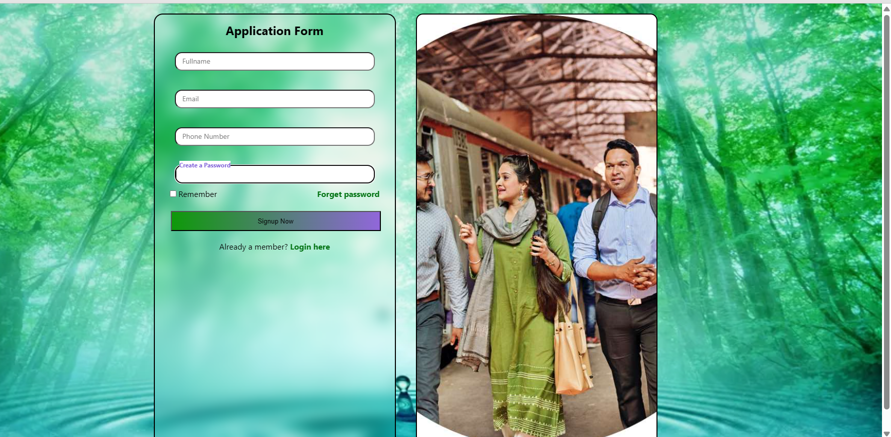

# 📝 Signup Form UI with Floating Labels

A modern and responsive **Signup Form UI** built entirely using **HTML** and **CSS**. This form features floating labels, clean design, and mobile responsiveness — ideal for learning frontend layout and UI design.

## ✨ Features

- Floating labels for input fields
- Light blue glass-like UI design
- Responsive layout using Flexbox and Media Queries
- Supports First Name, Last Name, Email, Username, Gender, Country, and Password fields

## 📸 Preview

> *(Replace `preview-url-here` with a GitHub-hosted screenshot or image of your form)*

## 🧾 Form Fields

- 👤 Fullname
- 📧 Email Address
- 🧑 phone number
- 🔒 Password
- checkbox(Remember me)

## 📁 File Structure

📠signup-form/ 
├── index.html 
├── style.css 
└── README.md 

## 📱 Responsive Design

- Optimized for mobile, tablet, and desktop
- Media queries included for screens as small as **320px**

## 💡 What I Learned

- Handling form layouts using Flexbox
- Implementing floating label technique
- Designing responsive UI without JavaScript
- `backdrop-filter`, `::placeholder-shown`, and smooth transitions

## 🧠 Future Improvements

- Add validation and interactivity using JavaScript
- Convert to a multi-step form with progress tracking
- Integrate with backend for real signup processing

## 🔗 Connect with Me

- 🔗 **GitHub**: [github.com/shahijahanQ](https://github.com/shahijahanQ)
- 🐦 **X (Twitter)**: [@shahijahanQ](https://x.com/shahijahanQ)
- 💼 **LinkedIn**: [shahijahan-pedhar](https://linkedin.com/in/shahijahan-pedhar)

---

📌 *This form UI was created as part of my CSS learning journey (June–July 2025). I'm excited to add interactivity with JavaScript soon!* 🚀
